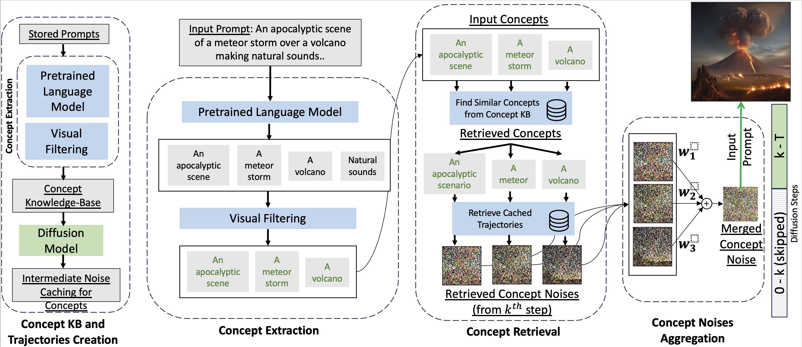

# ReCon: Training-Free Acceleration for Text-to-Image Synthesis with Retrieval of Concept Prompt Trajectories 



Official implementation of our ECCV 2024 paper [ReCon](https://www.ecva.net/papers/eccv_2024/papers_ECCV/papers/07666.pdf) for accelerating image generation using concept prompt trajectories.

## Overview

RECON is a method that generates target images by:
1. Extracting concepts from target prompts
2. Generating concept images with latent caching
3. Averaging cached latents at specific denoising steps
4. Using averaged latents to initialize final generation

This demo supports both FAISS-based concept retrieval and NLP-based concept extraction as fast demo.

## Quick Start

### Option 1: Conda (Recommended)

```bash

# Create environment
conda env create -f environment.yml
conda activate recon-demo

# Download spaCy model (optional, for better concept extraction)
python -m spacy download en_core_web_trf

# Run demo
python main.py --demo
```

## Usage

### Basic Demo

```bash
# Run with default sample prompt
python main.py --demo

# Run with custom prompt
python main.py --demo --prompt "a red car driving through a snowy forest"

# Specify output directory
python main.py --demo --output-dir ./my_results
```

### FAISS Index Setup (Optional)

For enhanced concept retrieval using DiffusionDB:

```bash
# Create FAISS index from DiffusionDB 2k subset
python create_faiss.py --subset 2k

# Create index with limited samples and verify
python create_faiss.py --subset 10k --max-samples 5000 --verify

# Show setup guide
python main.py --create-index
```


## Project Structure

```
recon-demo/
├── src/
│   ├── pipeline.py          # Modified SDXL pipeline
│   └── recon.py             # RECON generator class
├── main.py                  # Main entry point
├── create_faiss.py          # FAISS index creation from DiffusionDB
├── environment.yml          # Conda environment
├── requirements.txt         # Pip requirements
└── README.md               # This file
```


## Citation

If you use this code in your research, please cite:

```bibtex
@inproceedings{lu2024recon,
  title={RECON: Training-Free Acceleration for Text-to-Image Synthesis with Retrieval of Concept Prompt Trajectories},
  author={Lu, Chen-Yi and Agarwal, Shubham and Tanjim, Md Mehrab and Mahadik, Kanak and Rao, Anup and Mitra, Subrata and Saini, Shiv Kumar and Bagchi, Saurabh and Chaterji, Somali},
  booktitle={European Conference on Computer Vision},
  pages={288--306},
  year={2024},
  organization={Springer}
}
```

## Acknowledgments

- Built on [HuggingFace Diffusers](https://github.com/huggingface/diffusers)
- Uses [Stable Diffusion XL](https://huggingface.co/stabilityai/stable-diffusion-xl-base-1.0)